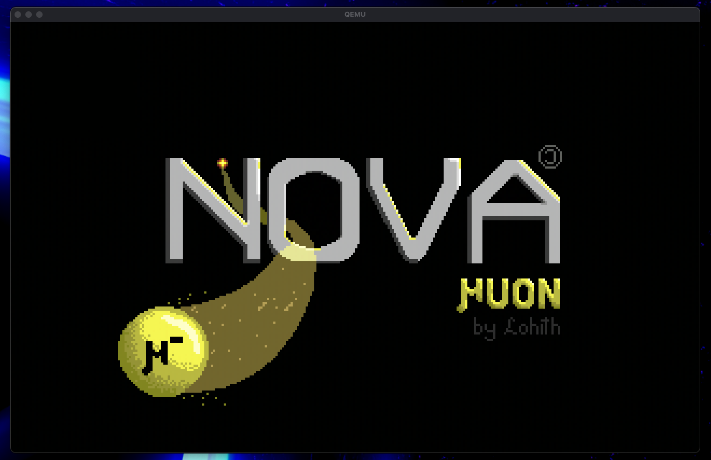
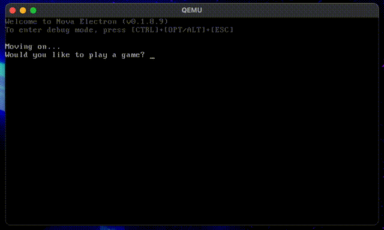

# Nova Muon (v0.1.9.1)

_A hobby operating system for x86, featuring plug-and-play libc, kernel, and drivers. Made for educational use by me, Lohith._

---

## Table of Contents

- [Features](#features)
- [Screenshots](#screenshots)
- [Getting Started](#getting-started)
- [Roadmap](#roadmap)
- [Contributing](#contributing)
- [License](#license)
- [Credits](#credits)

## Features

- Heap memory management (`malloc`, `free`, `calloc`, and `realloc`)
- Breakpoint interrupts
- Kernel text scrolling & IKD (Internal Kernel Debugger)
- Bootsplashes with GNU GRUB 2.12
- ANSI Escape Key support
- Scrolling and screen loading/saving support
- Switchable drivers with an agnostic kernel
- Stack Smash Protection

---

## Screenshots




---

## Getting Started

**Requirements**
- x86 emulator: currently only tested on QEMU (`qemu-system-i386`)
- GCC cross-compiler (`i686-elf-gcc`)
- GNU cross-binutils (`i686-elf-binutils`)
- GNU Make

**Building**

```
git clone https://github.com/LohithSridhar/Nova
cd Nova
make iso
```

**Running**
```
make quick-run
```
_Or, if you haven't built yet,_ `make run`.

**NOTE**: The Bootsplash is off by default. Do `make iso/run/cycle BOOTSPLASH=true` for it to be on (NOTE: DOES NOT WORK WITH `quick-run`).

**Cleaning**
```
make clean
```
_Or, if you want to run and clean quickly,_ `make cycle`.

Remember to clean after running the program if making changes, as `make iso` assumes that no `.o` or `.d` files exist yet.
---

## Roadmap

- [x] Internal Kernel Debugger
- [x] Basic Timer Functions (`rand`, `srand`)
- [x] Expanded libc/k (`str(n)dup`, `memccpy`, `atoi`, `sprintf`)
- [x] Optimisation of I/O (also added holding keys for the PS/2)
- [x] SSP and Improved Safety and Privacy features
- [x] Improved printf and scanf architecture (for futureproofing with FILE type)
- [x] New Name! (Muon)
- [ ] Basic Non-Switching Paging
- [ ] Best-Fit Memory Management
- [ ] Improved IKD with Stack Traceback
- [ ] Multithreading

---

## Contributing

Contributions and suggestions are welcome!  
Feel free to open issues or send pull requests.

---

## License

This project is licensed under the GNU General Public License v3.0 (GPLv3).

You can view the full license text [here](LICENSE).

This ensures that the project and any derivatives remain free and open-source under the same license.

---

## Credits

- Lead Developer: Lohith (more like _only_ developer, but okay)
- Inspired by the [OSDev Wiki](https://wiki.osdev.org/Main_Page) (although not in the attitude), Namely their [Meaty Skeleton](https://wiki.osdev.org/Meaty_Skeleton) OS Structure.